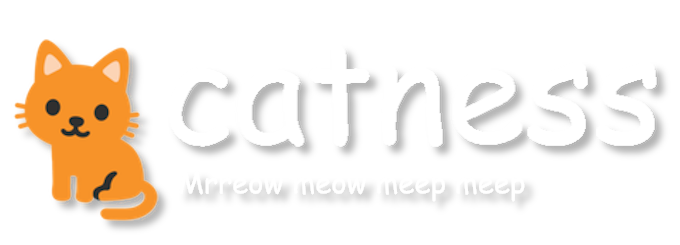

<div align="center">
  
  <div>
    <h1>The most meepious discord bot</h1>
    <p1>It does maybe a few things and we had fun making it (it is sometimes being worked on)</p1>
  </div>
  <h2>
    Contributors <br>
    <a href="https://github.com/razyness"></a>
    <a href="https://github.com/dazziedez"></a>
    <a href="https://github.com/RegorForgot"></a>
    <a href="https://github.com/crygup"></a
  </h2>
</div>

I think i don't know what to say about it maybe
# Setup
> [!WARNING]
> You should not host this bot yourself, it is annoying<br>
> Invite [this hosted instance](https://discord.com/oauth2/authorize?client_id=1008875850403414049&permissions=2063732172992&scope=applications.commands%20bot) if you want to maybe try it
## Requirements

Make sure you have the following installed:

- [Python](https://www.python.org/downloads/) (3.6 or higher)
- [PostgreSQL](https://www.postgresql.org/download/)
- [Git](https://git-scm.com/downloads)

I think you should use a virtual environment to manage dependencies:

```bash
# Create a virtual environment
python -m venv myenv

# Activate the virtual environment
# For Windows
myenv\Scripts\activate
# For macOS / Linux
source myenv/bin/activate
```
Also ensure all required Python modules are installed or it won't work ever:

```bash
(./venv)
pip install -r requirements.txt
```

## Database Setup

This bot uses PostgreSQL for its database (finally)

<details>
  <summary>the PostgreSQL schema in question</summary>
  
```sql
CREATE TABLE public.profiles (
    id bigint NOT NULL,
    socials jsonb DEFAULT '{}'::jsonb,
    cake jsonb,
    exp bigint DEFAULT 0,
    level bigint DEFAULT 0,
    levels_enabled boolean DEFAULT true,
    profile_private boolean DEFAULT false,
    tests_enabled boolean DEFAULT false,
    rep_value bigint DEFAULT 0,
    rep_time bigint DEFAULT 0,
    follows jsonb DEFAULT '{"followers": [], "following": []}'::jsonb
);

ALTER TABLE public.profiles OWNER TO postgres;

CREATE TABLE public.reminders (
    id bigint NOT NULL,
    task text,
    private boolean,
    channel text,
    reminder_id text NOT NULL,
    remind_time bigint
);

ALTER TABLE public.reminders OWNER TO postgres;

CREATE TABLE public.servers (
    id bigint NOT NULL,
    levels_enabled boolean DEFAULT true,
    welcome_type numeric DEFAULT 0
);

ALTER TABLE public.servers OWNER TO postgres;

ALTER TABLE ONLY public.profiles
    ADD CONSTRAINT profiles_pkey PRIMARY KEY (id);

ALTER TABLE ONLY public.servers
    ADD CONSTRAINT servers_pkey PRIMARY KEY (id);
```

</details>

By default the bot connects to `localhost` and uses the database `catness-db` and the password `catness`
<br>You can change it in playground.py

## Configuration

1. Rename `config.toml.example` to remove the `example`
2. Fill in the API keys and also the other things in `config.toml`

Here's an example of how `config.toml` should look:

```toml
### super secret things
TOKEN = "YOUR_DISCORD_BOT_TOKEN" # https://discord.com/developers/applications
LASTFM = "YOUR_LASTFM_API_KEY" # https://www.last.fm/api/authentication
STEAM = "YOUR_STEAM_API_KEY" # https://steamcommunity.com/dev/apikey
OPENAI = "YOUR_OPENAI_API_KEY" # Not needed, https://platform.openai.com/overview
TENOR = "YOUR_TENOR_API_KEY" # https://tenor.com/gifapi/documentation
MAKESWEET = "YOUR_MAKESWEET_API_KEY" # Private, you should ask them personally (They are very nice)

### actual config
prefix = "!"
report_channel = 1234

### user IDs for contributors
contributors = [
    # List of user IDs
]

### user IDs for friends
special = [
    # List of user IDs
]

### user IDs for the bot owners (Include yourself)
owners = [
    # List of user IDs
]

### statuses the bot will cycle through.
catchphrases = [
    # List of phrases
]
```

There are a few hardcoded variables (can't be bothered to list them)
  
## Customization

To customize the emojis used in the bot, replace the emojis in `./utils/data.py` with those that you uploaded to a server
<br>Defaults are found in `./media/emoji_images/`

> [!IMPORTANT]
> I just wanted to write this for fun
> <br>You can use this setup guide to test your bot before making pull requests
> <br>If i find out what you did i will be very upset
> <br>These colored things are very pretty


## How do i contribute??>

I would very very love it if you could maybe contribute if you have maybe nice ideas
<br>
#### Here is a very detailed guide:
1. Fork and clone
2. Make the changes
3. Pull request
then have some rest and then i will merge it one day


making readmes is very fun
